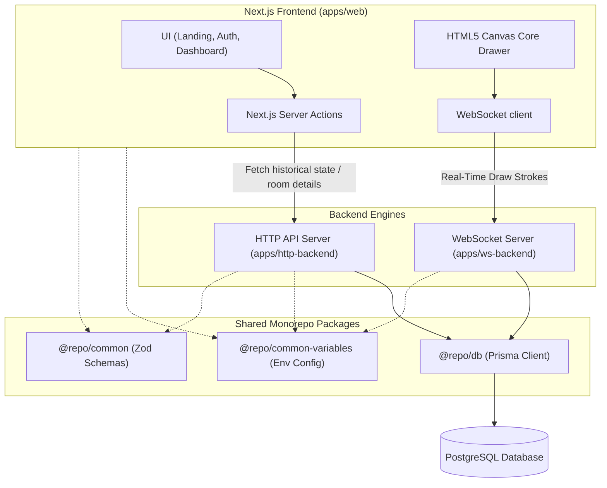
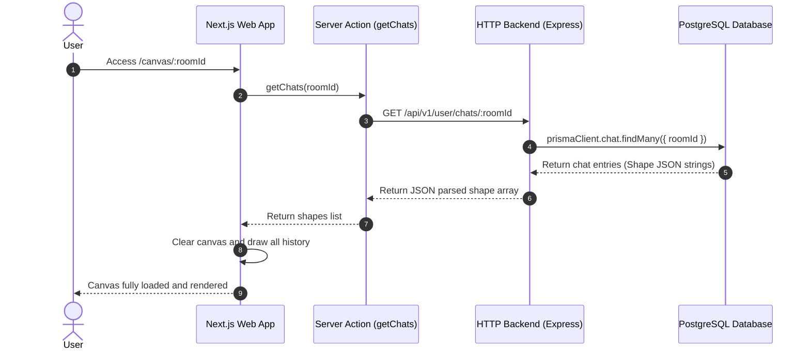
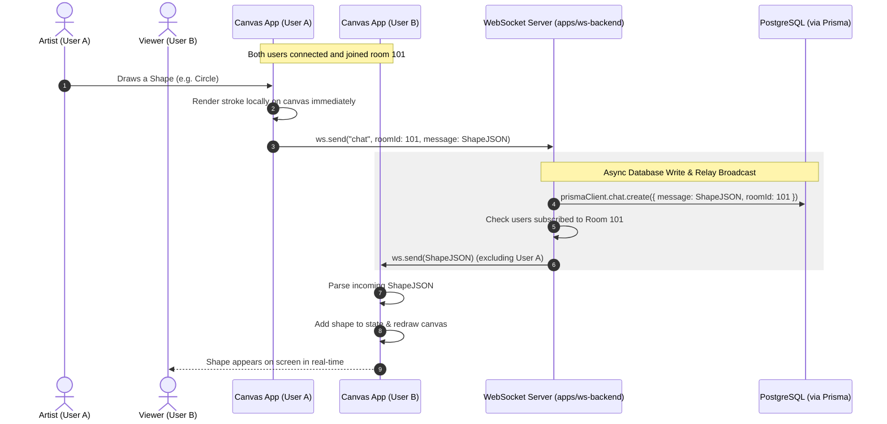

# Collaborative Drawing Application (Excalidraw Clone)

A high-performance, real-time collaborative canvas drawing board built as a monorepo using **Turborepo** and **pnpm**. Users can register, create rooms, and draw collaboratively in real-time.

---

## 🏗️ Monorepo Architecture

This workspace is structured as a monorepo separating concern between applications and shared packages:

```
├── apps
│   ├── web/               # Next.js frontend (App Router, TailwindCSS, HTML5 Canvas)
│   ├── http-backend/      # Express.js REST API (Authentication, Room Management)
│   └── ws-backend/        # ws-based WebSocket Server (Real-time Draw Synchronization)
├── packages
│   ├── db/                # Prisma client & PostgreSQL database schema
│   ├── common/            # Shared Zod validation schemas
│   ├── common-variables/  # Shared environment configurations (dotenv loader)
│   ├── eslint-config/     # Shared linting configs
│   └── typescript-config/ # Shared TypeScript tsconfig templates
```

---

## 💻 System Architecture



### 1. Frontend Architecture (`apps/web`)

- **Core Technologies**: Next.js (App Router), TypeScript, TailwindCSS.
- **Canvas Engine (`apps/web/app/canvas/[roomId]/InitDraw.ts`)**: Implements mouse event listeners (`mousedown`, `mousemove`, `mouseup`) to draw, preview, and commit shapes (`Rect`, `Circle`, `Line`, `Pencil`, `Text`) directly onto an HTML5 `<canvas>` element using the Canvas 2D Context API.
- **State Synchronization**:
  - Loads previous drawing state on initialization via Next.js Server Actions (`getChats`).
  - Emits and consumes collaborative drawing events via WebSockets.
  - Allows downloading drawings as PNG.

### 2. HTTP Backend Architecture (`apps/http-backend`)

- **Core Technologies**: Node.js, Express, TypeScript, JWT.
- **Responsibilities**:
  - **User Authentication**: Signup and signin validation using Zod. Password encryption utilizing `bcrypt`. Generation and validation of JSON Web Tokens (JWT).
  - **Room Management**: Creating and searching drawing rooms by URL slug.
  - **Chat / Shapes Fetching**: Retrieves all historical drawing shapes (chats) for a given room sorted chronologically so late joiners can render the canvas.

### 3. WebSocket Backend Architecture (`apps/ws-backend`)

- **Core Technologies**: Node.js, standard `ws` package.
- **Responsibilities**:
  - **Authentication**: Verifies JWT from query parameters on handshake connection (`?token=...`).
  - **Session Management**: Tracks active clients and maps them to room IDs.
  - **Real-time Synchronization**: When a user draws a shape, the client publishes a `"chat"` event. The WebSocket backend inserts the shape JSON directly into PostgreSQL and broadcasts the payload to all other connected clients currently in the same room.

---

## 🔄 Dynamic Workflows

### Workflow 1: Authentication & Loading History



### Workflow 2: Real-time Drawing & Broadcast Collaboration



---

## 🚀 Local Development Setup

Follow these steps to run the complete stack locally.

### 📋 Prerequisites

- **Node.js** (v18 or higher recommended)
- **pnpm** (v10+ package manager)
- **PostgreSQL** instance running locally or hosted

---

### 🛠️ Step-by-Step Setup

#### 1. Install dependencies from the project root

```bash
pnpm install
```

#### 2. Configure Database Environment Variables

Navigate to `packages/db`, copy the environment template, and configure your database connection:

```bash
cd packages/db
cp .env.example .env
```

Open the `.env` file and replace the `DATABASE_URL` placeholder with your PostgreSQL connection string:

```env
DATABASE_URL="postgresql://<username>:<password>@localhost:5432/<db_name>?schema=public"
```

#### 3. Run Database Migrations & Client Generation

Create database tables and generate the Prisma Client:

```bash
# From packages/db directory:
pnpm prisma migrate dev --name init
```

This runs the SQL migrations and automatically populates the `@prisma/client` package.

#### 4. Configure Shared Environment Variables

Navigate to the shared config directory, copy the template, and configure variables:

```bash
cd ../common-variables
cp .env.example .env
```

Provide the configurations (e.g., standard HTTP port, websocket port, and your secret key):

```env
PORT=6969
JWT_SECRET="your-very-secure-jwt-secret-string"
BACKEND_URL="http://localhost:6969"
WS_SERVER_URL="ws://localhost:9696"
WS_PORT=9696
```

---

### 🏃 Running the Application

Once variables and databases are configured, launch the entire workspace dev server from the root of the project:

```bash
# Return to the root directory
cd ../..

# Start all backend services and frontend apps in development mode
pnpm dev
```

Turborepo will spin up the services concurrently:

- **Frontend Next.js Web Application**: `http://localhost:3000`
- **HTTP Express API Server**: `http://localhost:6969`
- **WebSocket ws Server**: `ws://localhost:9696`

> [!TIP]
> Changes in any application or package will automatically trigger a hot reload.

---

## 🎨 Supported Drawing Tools

1. **Rectangle** 🟥
2. **Circle** ⚪
3. **Line** 📏
4. **Pencil** ✏️ (Freehand Drawing)
5. **Text** 🔠 (Click to type text inline)
